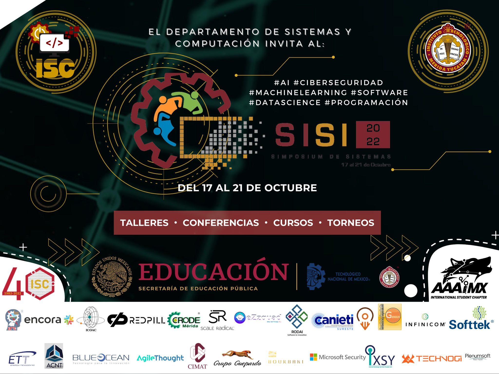

# Taller de desarrollo de plataformas web con Vue.JS y Django.
## Repositorio creado durante el SISI 2022.

SISI: Simposium de Sistemas Computacionales del instituto Tecnológico de Mérida.

----------------------------------



----------------------------------

## Project setup
```
npm install
```

### Compiles and hot-reloads for development
```
npm run serve
```

### Compiles and minifies for production
```
npm run build
```

### Lints and fixes files
```
npm run lint
```

### Customize configuration
See [Configuration Reference](https://cli.vuejs.org/config/).
